# COMPONENTES PC

**-Placa base**=Es una tarjeta de circuito impreso a la que se conectan los componentes que constituyen la computadora.

**-Chipset**=Es un circuito integrado que se encarga de la comunicación entre la CPU, la RAM, el almacenamiento y otros periféricos.En este caso es Intel® H81 Express Chipset.

 
**1.Ranura DIMM**=Memoria USB o memoria RAM que consiste en una serie de circuitos integrados de memoria de acceso aleatorio dinámico montados en una placa de circuito impreso.

**2 & 3.Ranura PCI**=Desarrollado por Intel Corporation,es un bus de alta velocidad estándar del sector que se encuentra en casi todas las computadoras de escritorio.
En este caso la 2 es una ranura PCI Express x16 slots,y la 3 son dos pequeñas ranuras PCI Express x1 slots.

**4.Pila**=Fuente de energía del BIOS.

**5.Socket**=El socket o zócalo es la zona de la placa base donde se instala la CPU, posicionada al costado de los slots de memoria RAM y justo encima de las ranuras PCI-Express.

**-Disco Duro**=Dispositivo de almacenamiento de datos no volátil que emplea un sistema de grabación magnética para almacenar datos digitales de forma rápida y segura.

**-Tarjeta de red**= Se encarga de la preparación, la transferencia y el control de los datos que se reciben y envían desde el ordenador a Internet o a otros equipos que comparten la misma red.

**-Fuente de alimentación**=Dispositivo que se utiliza para convertir la corriente de la red eléctrica en una forma de energía adecuada para los componentes de un dispositivo o sistema electrónico.

  
**-CPU(Procesador)**=Una CPU, o unidad central de procesamiento, es un componente de hardware y la unidad computacional central de un servidor.

**-Disipador CPU**= Un elemento o pieza cuya misión es extraer el calor que genera el procesador.

**-Memoria RAM**=Es la memoria de la computadora que almacena la información que un programa necesita mientras se ejecuta.

**-Ranura AGP**=El Puerto de gráfico acelerado es una especificación de bus que proporciona una conexión directa entre el adaptador de gráficos y la memoria.(En esta placa base no hay pero es importante mencionarla).

# 1. DESMONTAJE DEL EQUIPO

**- Se quita la carcasa
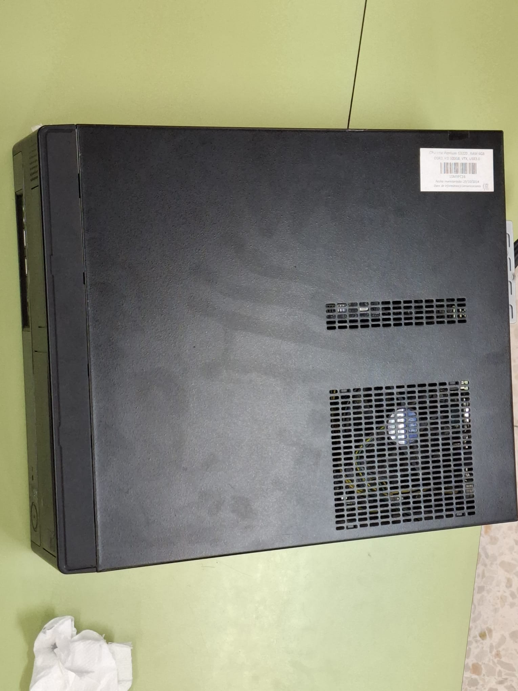
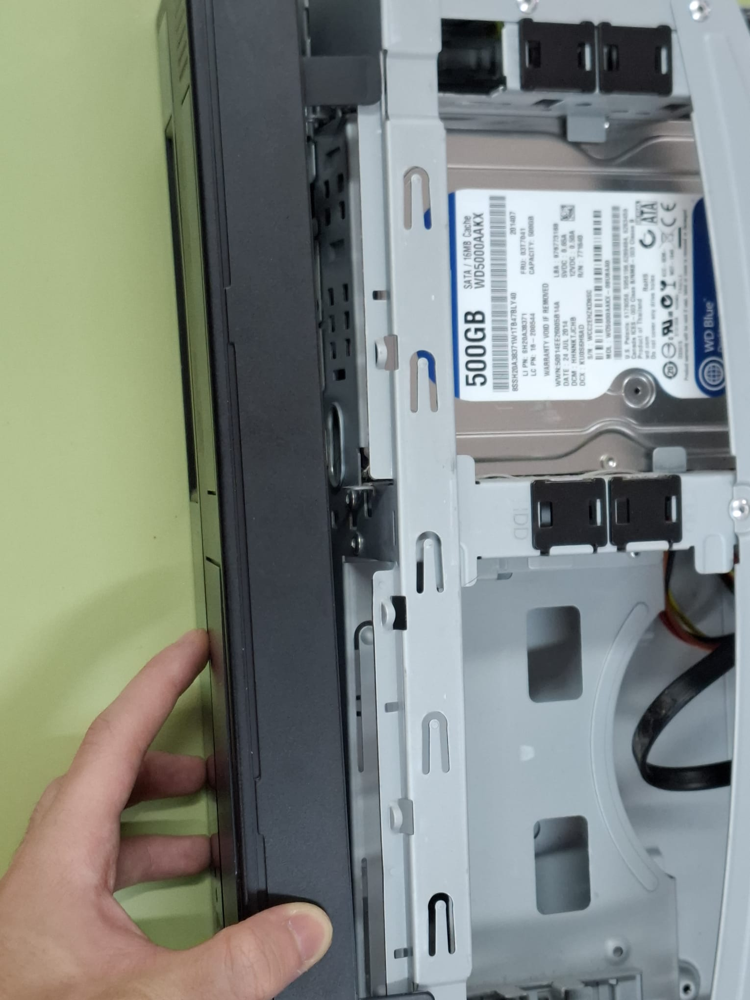

**- Se comienza a desconectar todo el cableado de la fuente de alimentación de la placa base el cual (se recomienda quedarse en mente con la manera en que se han descolocado)
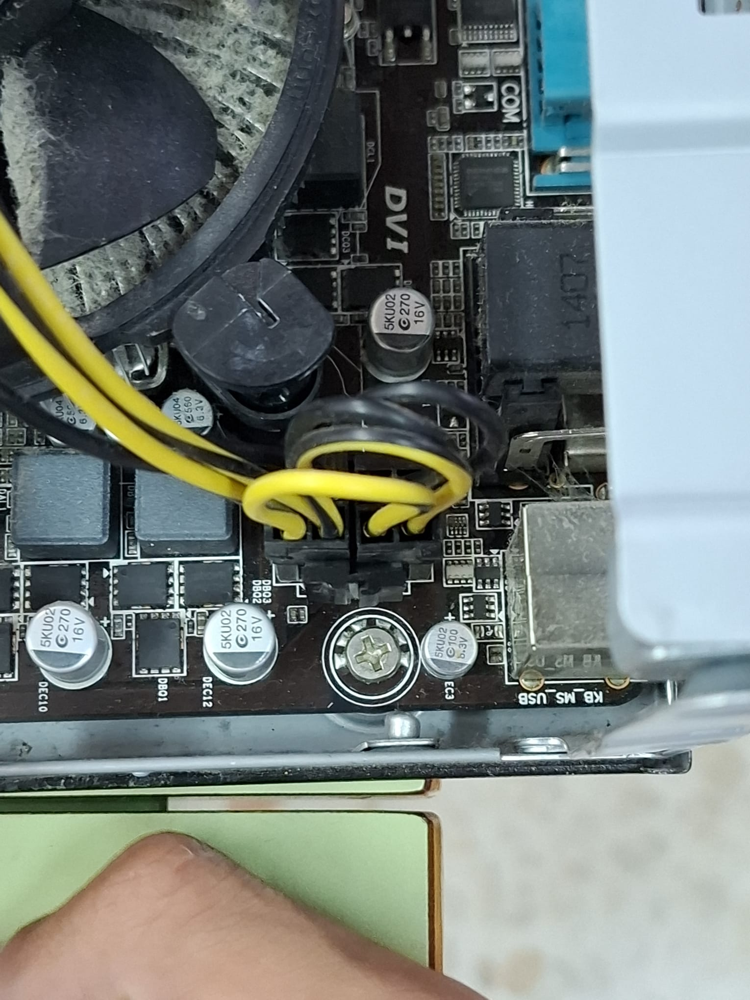
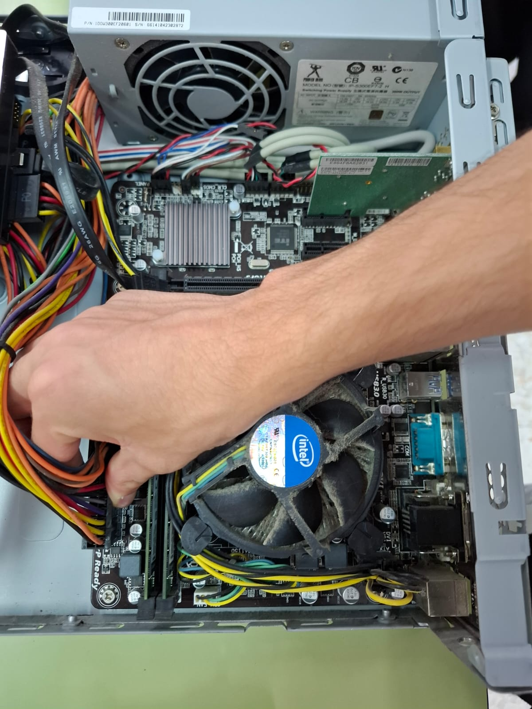
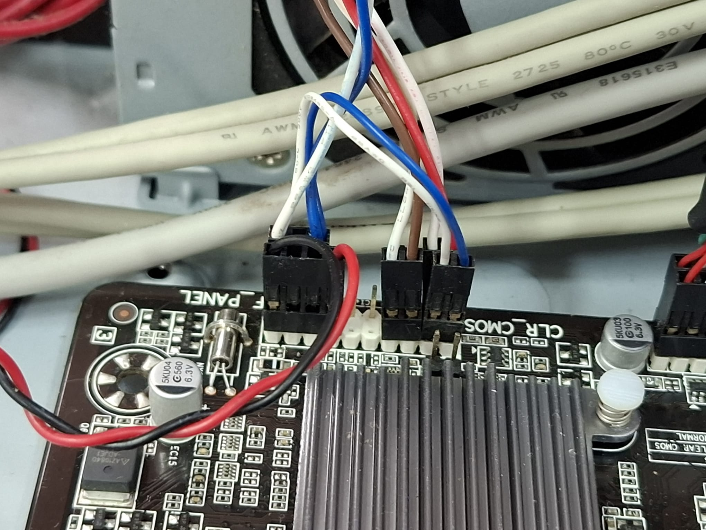

**- Se quita la memoria RAM levantando las pinzas que la aseguran a la placa base
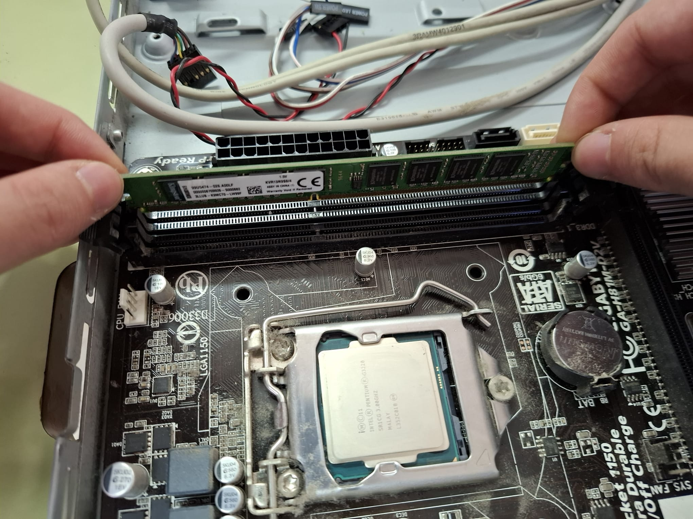

**- Se levanta el disipador tras desconectarlo de la placa base dependientemente del disipador levantando las pestañas que lo aseguran
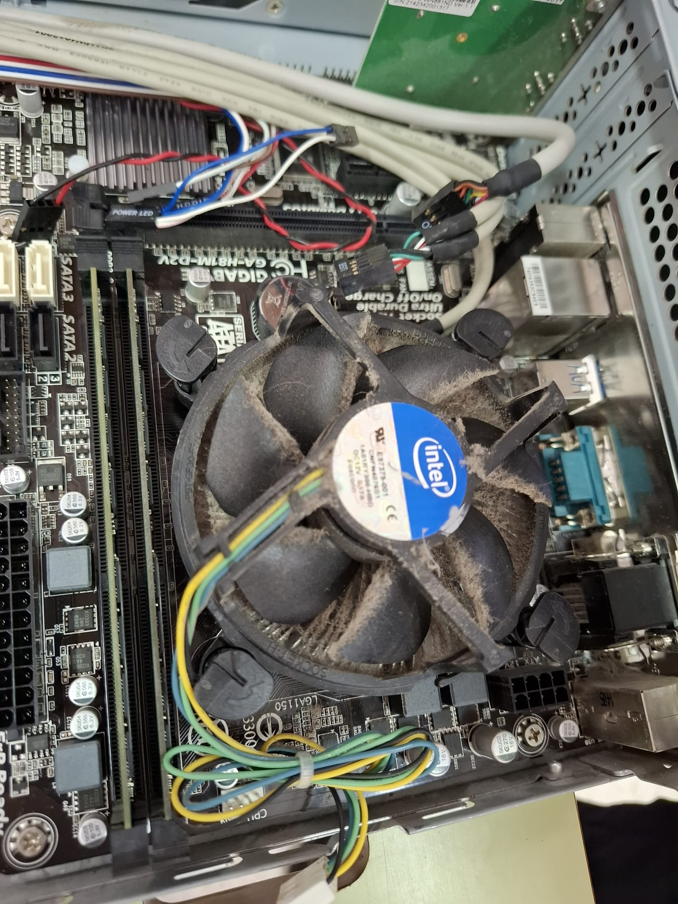

**- Se quita la CPU levantando el seguro del mismo
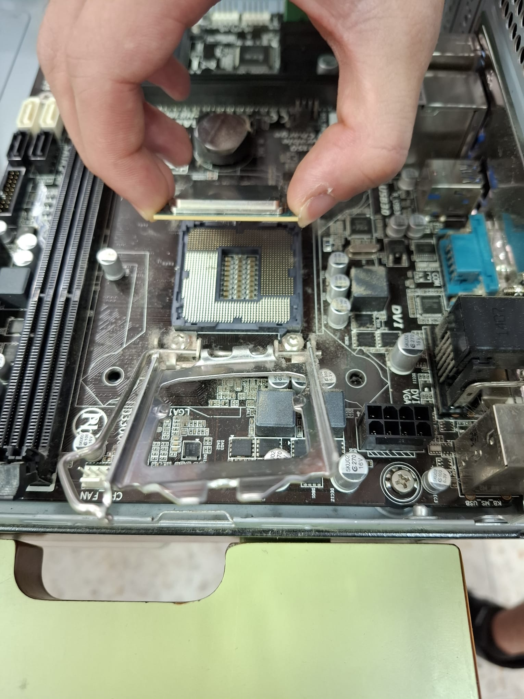

**- Se limpia la pasta térmica tanto de la CPU como del disipador 
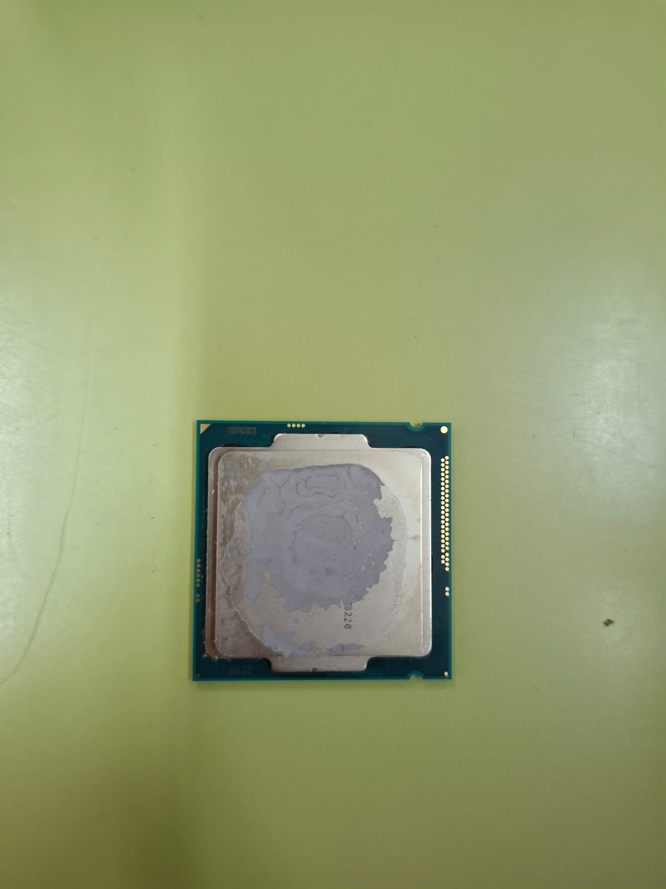

**- Se quita la tarjeta de red desatornillando la pieza que la asegura
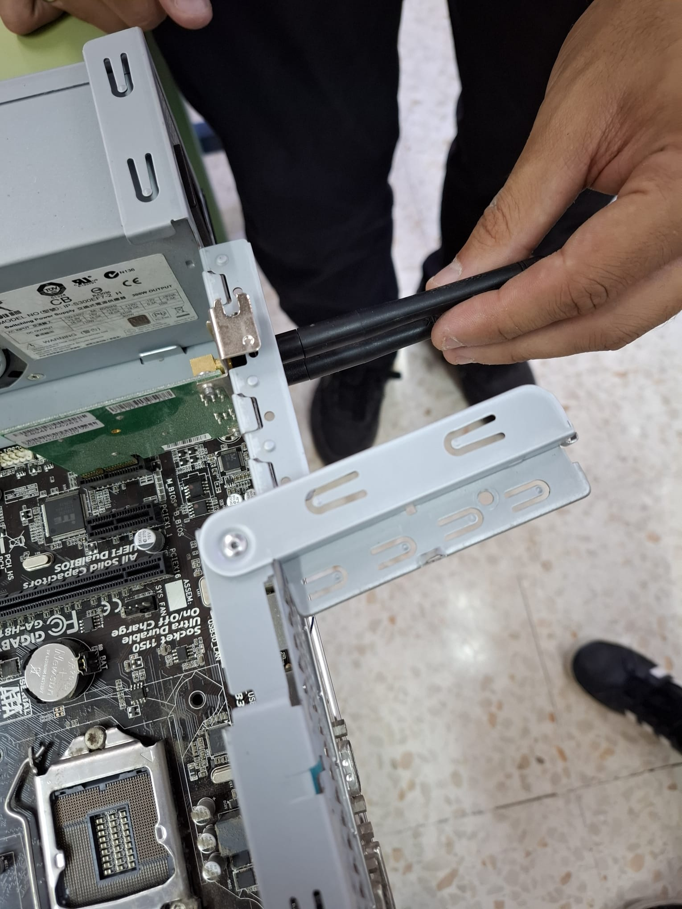

**- Se quita el disco duro y sus conexiones correspondientes
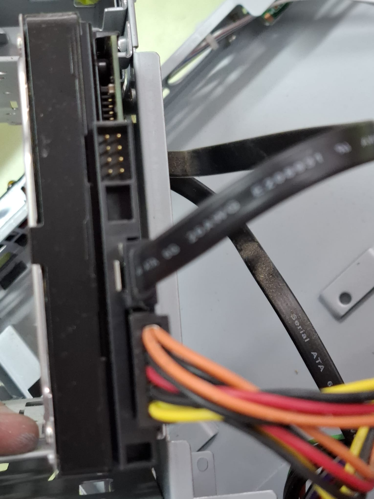
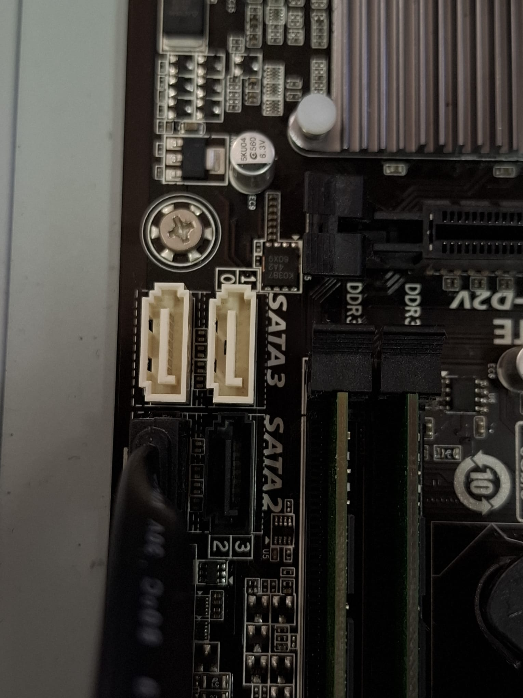

** Una vez desconectado todo se puede desatornillar la placa base de la caja
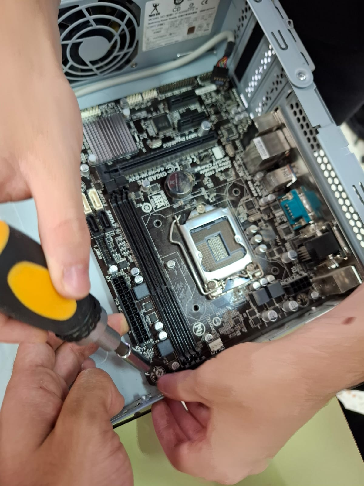

# 2. MONTAJE DEL EQUIPO

** Se atornilla la placa base a la caja

**- Se coloca la memoria RAM levantando y apretando las pinzas que la aseguran a la placa base

**- Se coloca la CPU levantando el seguro del mismo y una vez colocada se pone el seguro

**- Se aplica la pasta térmica en la CPU de manera que se esparza bien tras colocar el disipador (esto se puede realizar de múltiples maneras en nuestro caso lo hemos aplicado en x)
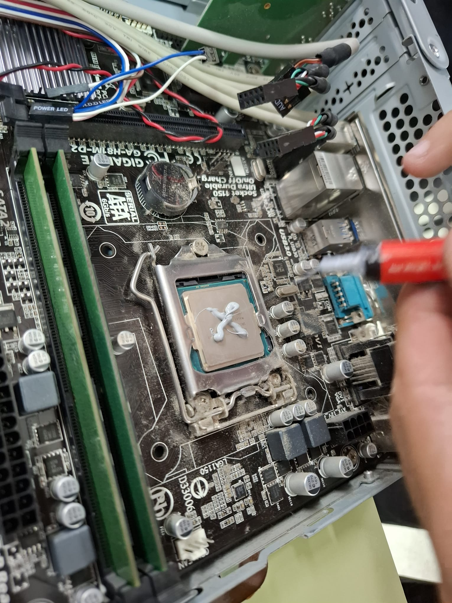

**- Se coloca el disipador sobre la CPU asegurándolo a la placa base

**- Se coloca la tarjeta de red en su correspondiente ranura asegurándola con su tornillo

**- Se coloca el disco duro y sus conexiones correspondientes

**- Se conectan los cables de encendido a la placa base en su orden correspondiente

**- Se coloca la carcasa completa

## CONECTORES

**1.Puerto Usb 2.0**=USB es la sigla de Universal Serial Bus.Se trata de un concepto de la informática para nombrar al puerto que permite conectar periféricos a una computadora.Estas permiten transferir datos, imágenes, vídeos y archivos en general a una velocidad de 60 Mb por segundo.En este caso hay 6,dos en la parte trasera y cuatro en la parte delantera.

**3.Puerto Usb 3.0**=Es la tercera versión importante de la Universal Serial Bus estándar para la conectividad informática. USB 3.0 tiene una velocidad teórica de transmisión de hasta 4,8 Gbit/s o 600MB/s, que es diez veces más rápido que USB 2.0.En este caso hay 4,todos en la parte trasera.

**4.Puerto Ethernet**=Tecnología que permite que los dispositivos de redes de datos conectados por cable se comuniquen entre sí y esta es la entrada del cable.

**5.Puerto VGA**=Se considera una tecnología de la vieja escuela. De hecho, es uno de los estándares de conexión más antiguos del mercado actual.Se utiliza para conectar dispositivos de salida de video a computadoras y proyectores a pantallas, monitores y televisores.

**6.Puerto Serie**:Es una interfaz de comunicación digital de datos en la que la información se transmite de forma secuencial bit a bit.

**7.Puerto DVI-I**=Se trata de un tipo de conexión de vídeo destinada a llevar la señal de la tarjeta gráfica de tu ordenador al monitor.

**8.Puerto PS/2**=Puerto diseñado para conectar teclados y ratones al ordenador.

**2 & 9. Puerto Jack 3,5mm**=Son puertos para conectar los diferentes dispositivos de audio, como son altavoces, micrófono, dispositivos de audio, etc. Se trata de conectores Jack de 3,5mm. Se clasifican por colores:

   - De color naranja, subwoofer.
   - De color azul claro, entrada de línea.
   - De color negro, altavoces traseros.
   - De color verde, altavoces delanteros.
   - De color gris, altavoces laterales.
   - De color rosa, micrófono.

En este caso,la placa solo dispone de los puertos de color azul,verde y rosa.
## Alejandro Nasri Escarti, Angel Gallardo Trigueros, Rafael Jaen Roldan
